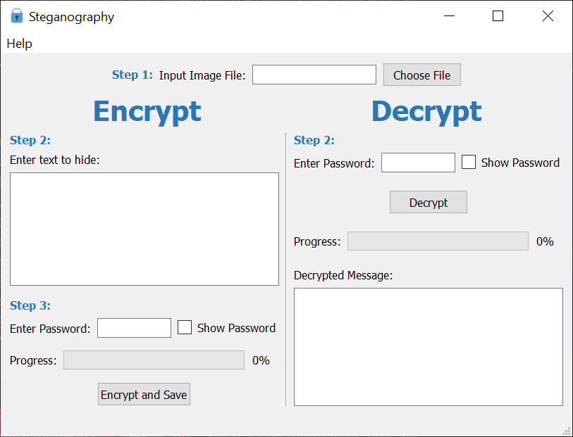

# Least Significant Bit Steganography Desktop Application
This is a desktop application for Least Significant Bit Steganography. It is written in Python and uses PyQt5 for the GUI.

## Usage
* To use this application, you need to have Python 3.6 or higher installed on your computer. You can download it from [here](https://www.python.org/downloads/).

* Clone this repository to your computer using the following command:
```
git clone https://github.com/dizzyme09/lsb-steganography-gui
```

* Next, you need to install the required packages. You can do this by running the following command in the terminal:
```
pip install -r requirements.txt
```

* Finally, you can run the application by running the following command in the terminal:
```
python lsb_steganography_gui.py
```

## Screenshots
